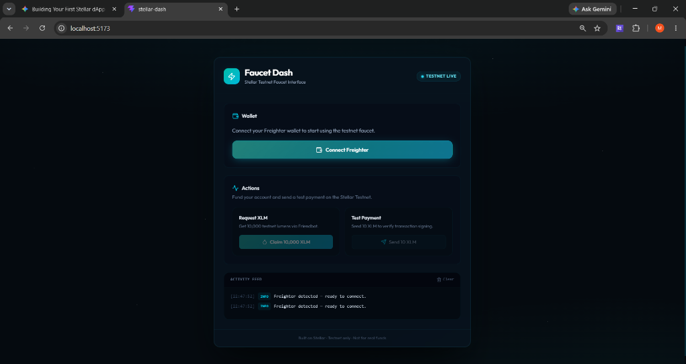
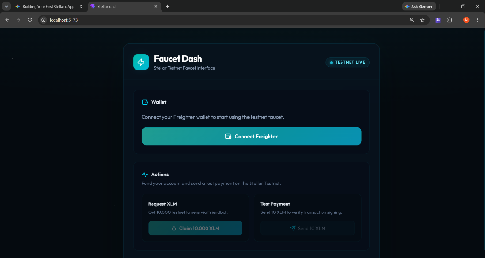
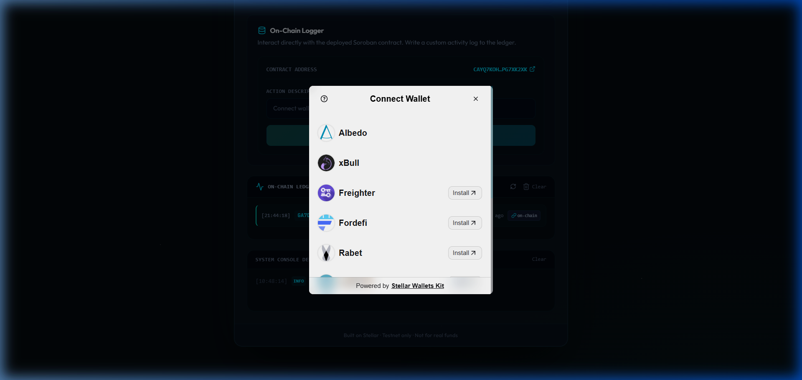
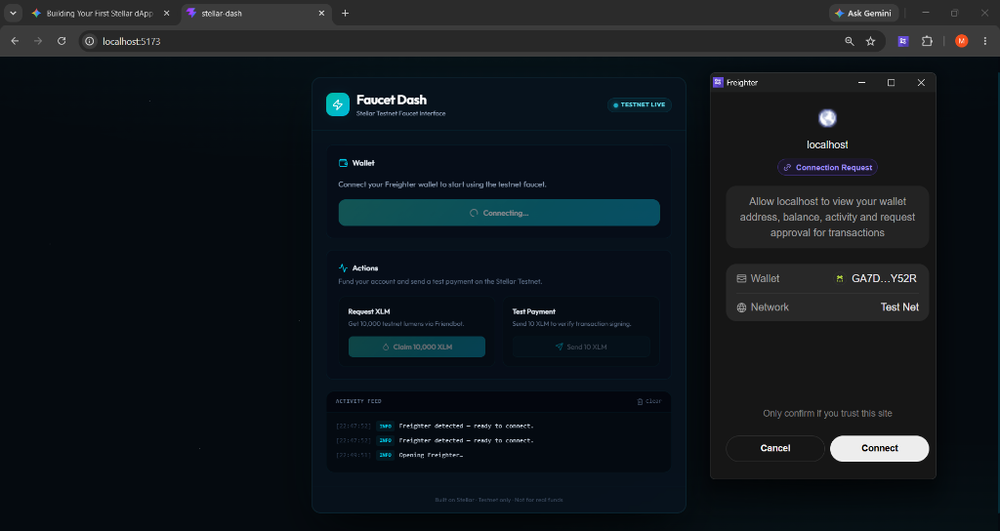
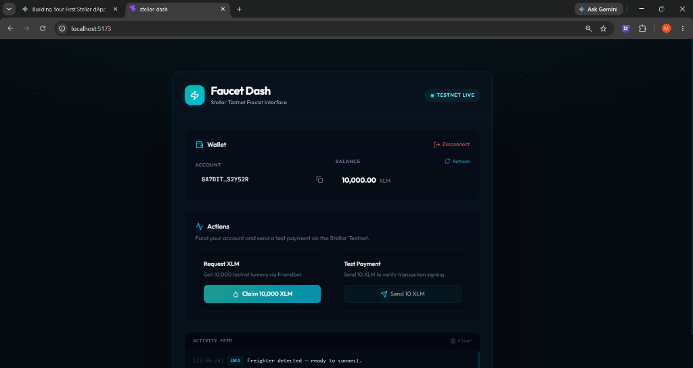
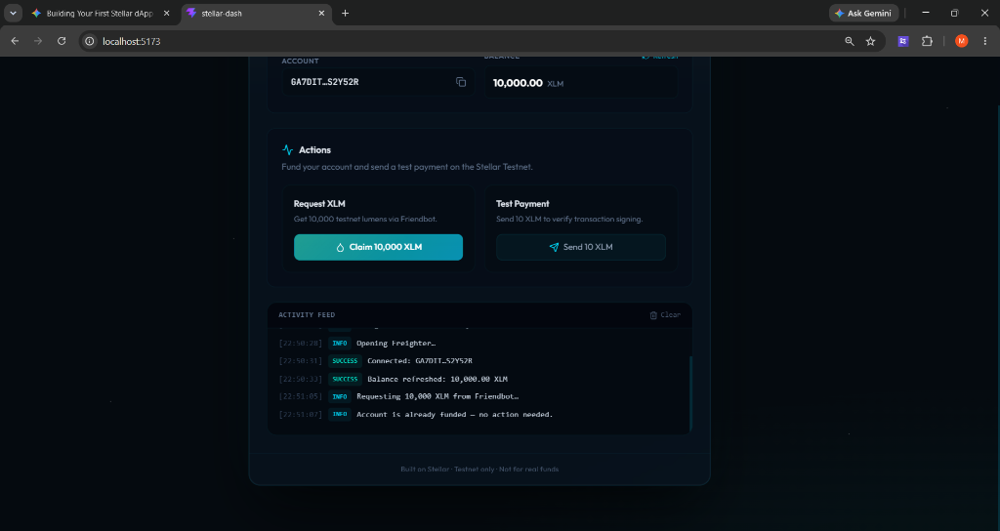
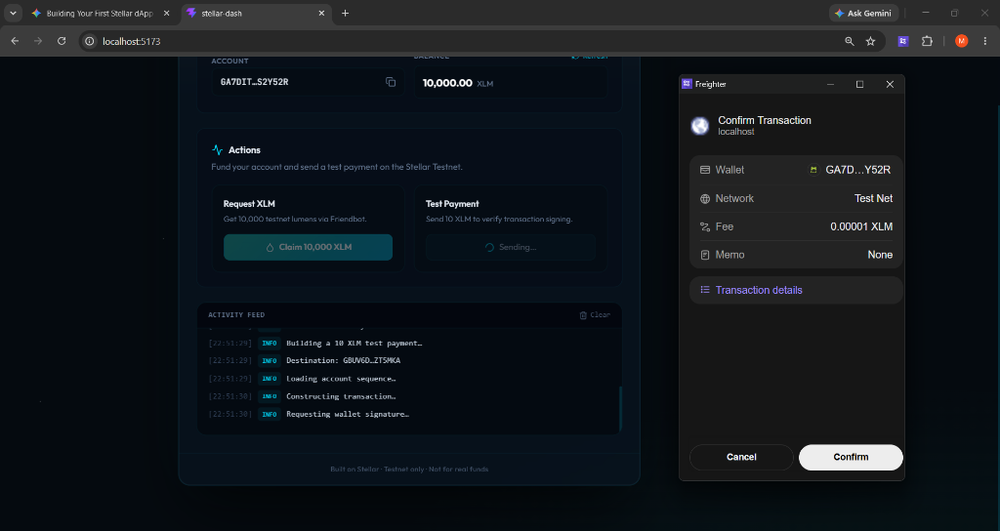
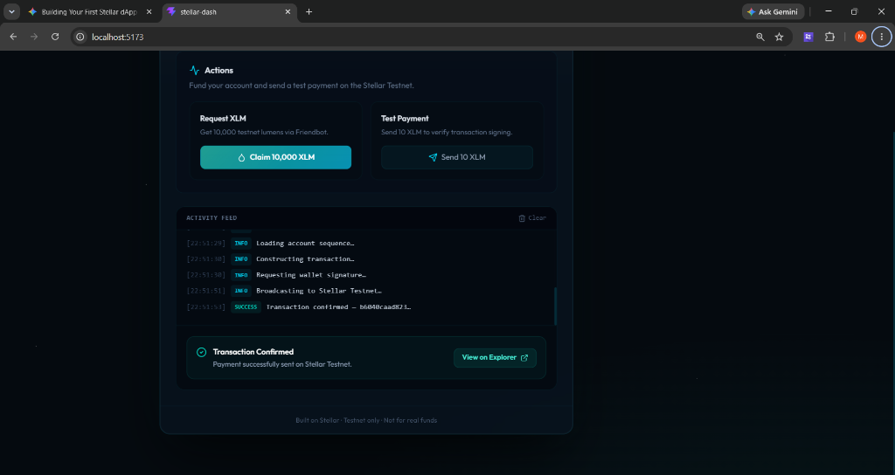
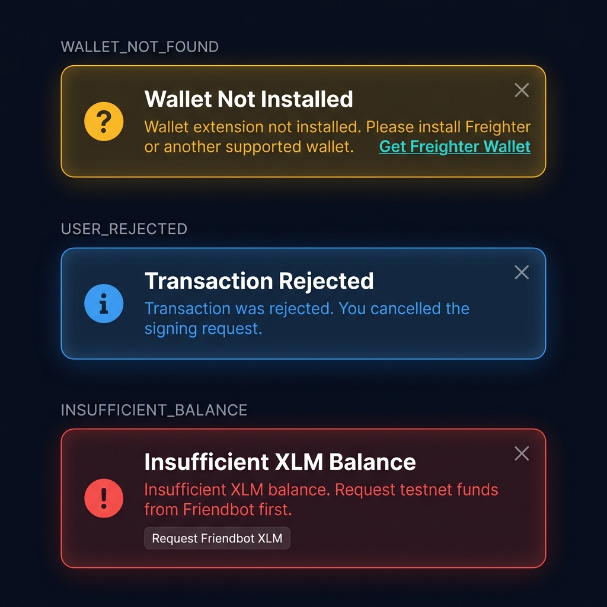

# ⚡ Faucet Dash

> [!TIP]
> **Live Demo**: [stellar-dash-one.vercel.app](https://stellar-dash-one.vercel.app/)

**Faucet Dash** is a premium, modern developer dashboard for interacting with the **Stellar Testnet**. Built with React, TypeScript, and Tailwind CSS, it offers a visual interface for developers to connect their **Freighter** wallet, check their testnet balance, request funds from Friendbot, and sign test transactions safely.

---

## 🚀 Features

- **Freighter Wallet Integration**: Securely connect and authorize the dashboard using the Freighter browser extension (`@stellar/freighter-api`).
- **Real-time Balance Checker**: Instantly check and refresh your account's testnet XLM balance.
- **Friendbot XLM Faucet**: Request 10,000 testnet lumens (XLM) at the click of a button to activate or fund your account.
- **Test Payments signing**: Build and sign a 10 XLM test payment to a randomly generated Stellar address to verify transaction signing.
- **Real-time Activity Log**: A live console tracking every state change, transaction building, signing, and broadcasting activity.
- **Deep Space UI**: Premium, dark-mode design system utilizing glassmorphism, glowing accents, and smooth float animations.

---

## 📸 User Flow & Screenshots

Below is the step-by-step workflow of Faucet Dash, showing the wallet connection and testnet faucet request:

### 1. Faucet Dash UI Loaded
Upon launching the dashboard, the interface automatically runs a check for the Freighter extension. The activity feed logs the detection status.


### 2. Ready to Connect
The actions panel remains disabled until a wallet is connected, ensuring a safe developer workflow.


### 2.5 Wallet Options Available (Multi-Wallet Selection)
Clicking **Connect Wallet** displays the `StellarWalletsKit` selector dialog with multiple wallet integrations (Freighter, Lobstr, xBull, Hana, Rabet, Albedo).


### 3. Freighter Wallet Connection Request
Clicking **Connect Freighter** prompts the extension to launch a secure connection authorization popup to link your public address to the dashboard.


### 4. Wallet Connected & Balance Updated
Once connected, the wallet panel displays your truncated Stellar public key (with copy-to-clipboard functionality) and fetches your live testnet XLM balance.


### 5. Requesting Testnet XLM (Friendbot Funding)
Requesting funds triggers a fetch to the Stellar Friendbot. The transaction is logged in the activity console in real-time.


### 6. Test Payment Transaction Signing
Clicking **Send 10 XLM** constructs a test payment transaction and opens the Freighter extension popup requesting you to sign and confirm the transaction.


### 7. Transaction Confirmed & Explorer Link
Once signed, the transaction is broadcasted to the Stellar Testnet. Upon confirmation, a success alert is shown with a link to view the transaction on the Stellar Expert explorer.


### 8. 🛡️ Error Handling — 3 Error Types (Level 2 Requirement)

The dashboard implements **3 distinct typed error banners** that appear when something goes wrong:

| Error Type | Trigger | Banner Color |
|---|---|---|
| `WALLET_NOT_FOUND` | Wallet extension not installed | 🟡 Amber |
| `USER_REJECTED` | User cancels the wallet signing popup | 🔵 Blue |
| `INSUFFICIENT_BALANCE` | Account has insufficient XLM | 🔴 Red |

Each banner auto-dismisses after 8 seconds or can be closed manually. The `INSUFFICIENT_BALANCE` banner includes a **"Request Friendbot XLM"** action button directly inside the error message.



---

## 🛠️ Tech Stack & Architecture

- **Framework**: React 19 (TypeScript)
- **Build Tool**: Vite 8
- **Styling**: Tailwind CSS v4 + Custom HSL glassmorphism design tokens
- **Stellar Libraries**:
  - `@stellar/stellar-sdk` (Horizon Client, Transaction Builder, Operations)
  - `@stellar/freighter-api` (Wallet communication and signing)
- **Vite Polyfills**: `vite-plugin-node-polyfills` (required for buffer/process polyfills when compiling Stellar transaction XDRs)

---

## 🏃 Getting Started

### Prerequisites
Make sure you have [Node.js](https://nodejs.org/) installed, and the [Freighter Extension](https://www.freighter.app/) added to your browser.

### Installation

1. Clone the repository:
   ```bash
   git clone https://github.com/your-username/stellar-dash.git
   cd stellar-dash
   ```

2. Install dependencies:
   ```bash
   npm install
   ```

3. Run the development server:
   ```bash
   npm run dev
   ```
   Open [http://localhost:5173/](http://localhost:5173/) in your browser to view the application.

4. Build the application for production:
   ```bash
   npm run build
   ```

---

## 🟡 Level 2 Upgrade (Yellow Belt)

Level 2 upgrades Faucet Dash into a multi-wallet, smart-contract-powered dashboard with real-time on-chain event tracking.

### Deployed Contract Details
- **Smart Contract ID**: `CAYQ7KOH25S6EDCQTBIG4PIAULUHYO4TFJ3LXKCV75AAOGNIPG7XK2XK` (view on [Stellar Expert](https://stellar.expert/explorer/testnet/contract/CAYQ7KOH25S6EDCQTBIG4PIAULUHYO4TFJ3LXKCV75AAOGNIPG7XK2XK))
- **Contract Instantiate Transaction Hash**: `ffb51fdd225f5b620d5b02b9c980f4d34548cb7dbc963fea3a0599b0f8967784` (view on [Stellar Expert Explorer](https://stellar.expert/explorer/testnet/tx/ffb51fdd225f5b620d5b02b9c980f4d34548cb7dbc963fea3a0599b0f8967784))
- **Verifiable Contract Call Transaction Hash (`log_activity`)**: `cc7e44f5b4464754b30d96a9038f3da82d9c21fa78171f35311a65e17b27c415` (view on [Stellar Expert Explorer](https://stellar.expert/explorer/testnet/tx/cc7e44f5b4464754b30d96a9038f3da82d9c21fa78171f35311a65e17b27c415))
- **Live Demo Link**: [stellar-dash-one.vercel.app](https://stellar-dash-one.vercel.app/)

### Level 2 Setup & Installation

1. Copy the `.env.example` template into a new `.env` file in the root directory:
   ```bash
   cp .env.example .env
   ```
2. Build the application for production to generate optimized chunk files:
   ```bash
   npm run build
   ```

### 🛠️ Tech Stack & Architecture

- **Framework**: React 19 (TypeScript)
- **Build Tool**: Vite 8
- **Styling**: Tailwind CSS v4 + Custom HSL glassmorphism design tokens
- **Stellar Libraries**:
  - `@stellar/stellar-sdk` (Horizon Client, Transaction Builder, Operations, Soroban / Stellar RPC)
  - `@creit.tech/stellar-wallets-kit` (Unified wallet selector supporting Freighter, Lobstr, xBull, Hana, Rabet, Albedo)
- **Vite Polyfills**: `vite-plugin-node-polyfills`

---

## ⚠️ Important Developer Notes

- **Testnet Only**: This application is configured to interact strictly with the **Stellar Testnet** (`https://horizon-testnet.stellar.org`) and uses the Testnet passphrase. Do not attempt to sign Mainnet transactions.
- **Freighter Extension Settings**: Ensure your Freighter extension is configured to the **Test Net** network before testing transaction signing.

