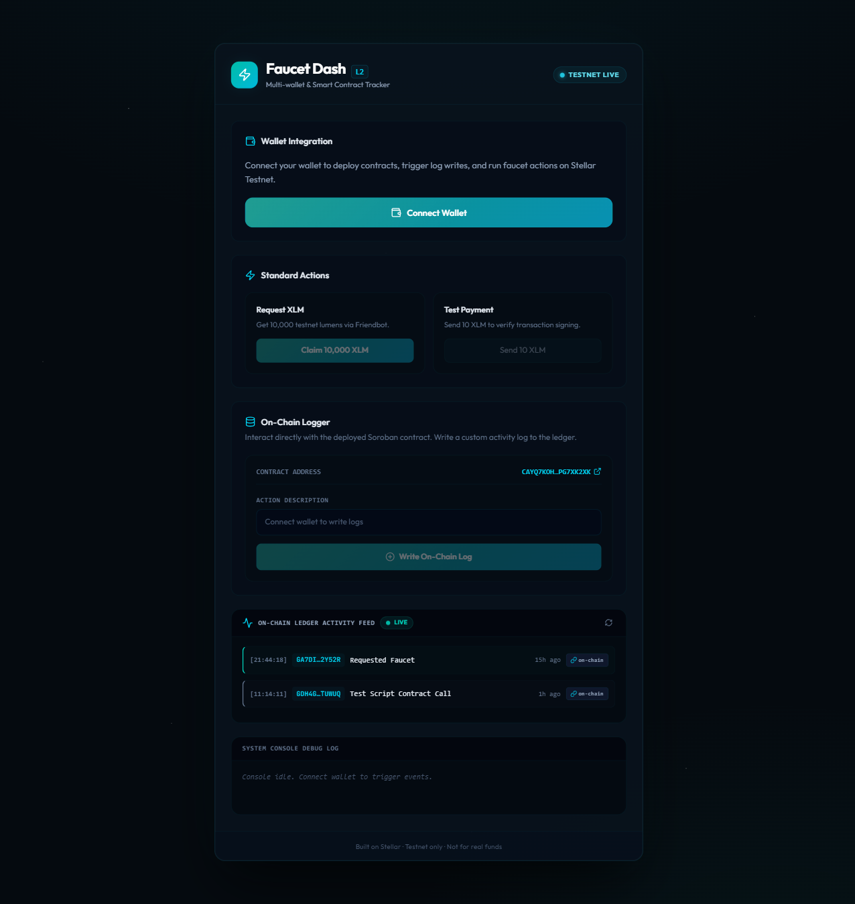
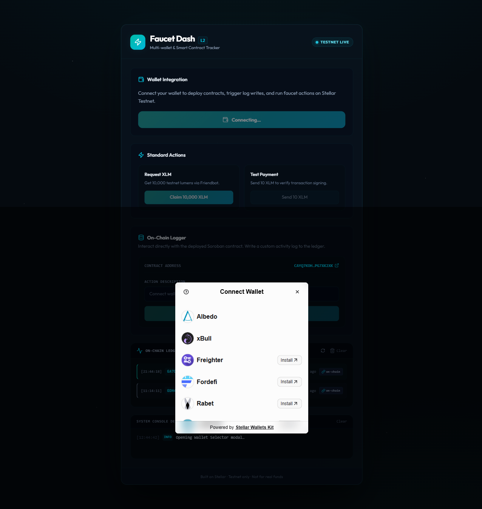
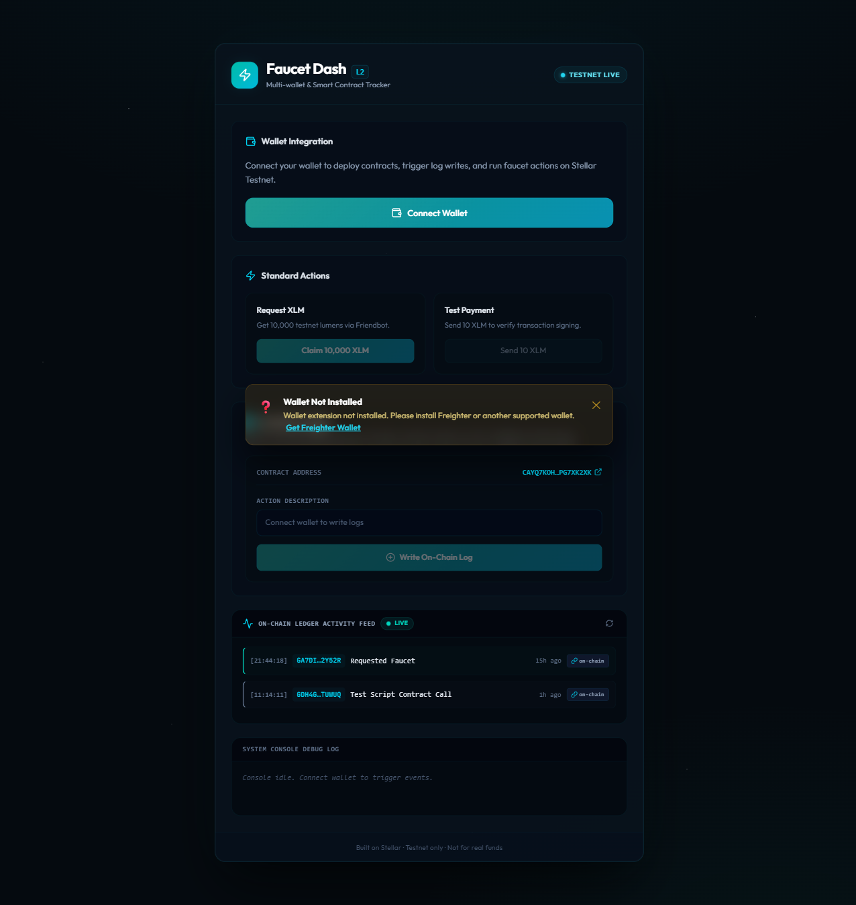
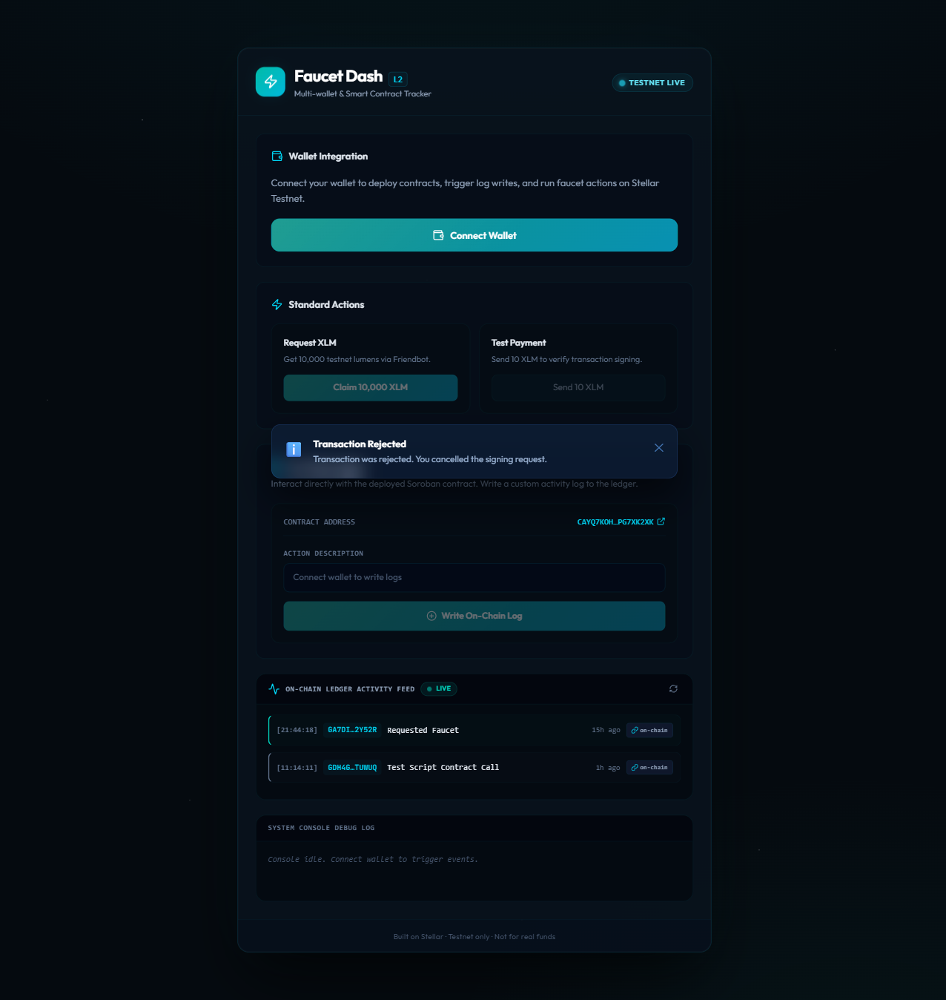
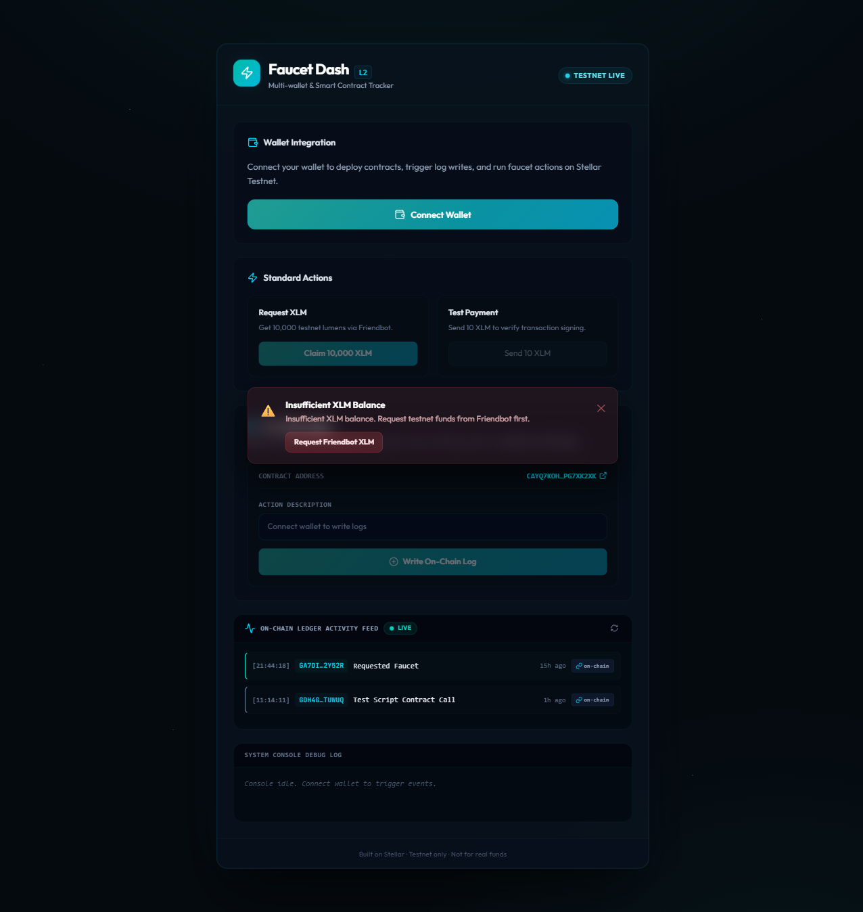

<div align="center">



# ⚡ Faucet Dash

### Multi-Wallet Stellar Testnet Dashboard with Smart Contract Integration

[](https://stellar-dash-one.vercel.app/)
[](https://stellar.org/)
[](https://react.dev/)
[](https://www.typescriptlang.org/)
[](https://vitejs.dev/)
[](https://tailwindcss.com/)

</div>

---

## 📖 Overview

**Faucet Dash** is a premium developer dashboard for interacting with the **Stellar Testnet**. It combines multi-wallet connectivity (via StellarWalletsKit), smart contract integration, and real-time on-chain event streaming into a beautifully crafted dark-mode interface.

Built for the **Yellow Belt (Level 2)** challenge, this project demonstrates:
- 🔗 Multi-wallet support across 5+ Stellar wallets
- 📜 Deployed Soroban smart contract with frontend integration
- 🛡️ Typed error handling with 3 distinct error states
- 🔄 Real-time on-chain activity feed with 5-second polling
- 📊 Live transaction status tracking across 6 lifecycle states

---

## ✨ Features

| Feature | Description |
|---|---|
| **Multi-Wallet Integration** | StellarWalletsKit supporting Freighter, Albedo, xBull, Rabet, Fordefi |
| **Smart Contract Logger** | Deployed Soroban `ActivityLogger` contract called directly from the UI |
| **Real-Time Activity Feed** | On-chain events polled every 5s and displayed as a live ledger feed |
| **Transaction Status Tracker** | 6-state lifecycle: `idle → building → signing → pending → success/failed` |
| **3 Typed Error Banners** | `WALLET_NOT_FOUND`, `USER_REJECTED`, `INSUFFICIENT_BALANCE` |
| **Friendbot Faucet** | One-click 10,000 testnet XLM funding for new accounts |
| **Test Payment Signing** | Build, sign, and broadcast a 10 XLM payment via the connected wallet |
| **Balance Refresh** | Live XLM balance with manual refresh and unfunded account detection |

---

## 🖥️ Screenshots

### Dashboard — Connected State
The main dashboard showing wallet integration, contract actions, and the real-time on-chain activity feed.


### Multi-Wallet Selector
Clicking **Connect Wallet** opens the `StellarWalletsKit` modal with all supported wallets.



---

## 🛡️ Error Handling — 3 Typed Error States

The dashboard implements **3 distinct typed error banners** triggered by real error conditions:

| Error Type | Trigger Condition | UI |
|---|---|---|
| `WALLET_NOT_FOUND` | Wallet extension not installed in browser | 🟡 Amber banner |
| `USER_REJECTED` | User cancels the wallet signing popup | 🔵 Blue banner |
| `INSUFFICIENT_BALANCE` | Account balance < 11 XLM before payment | 🔴 Red banner with Friendbot CTA |

Each banner auto-dismisses after 8 seconds and can be closed manually.

**`WALLET_NOT_FOUND` — Amber:**


**`USER_REJECTED` — Blue:**


**`INSUFFICIENT_BALANCE` — Red:**


---

## 📜 Smart Contract — ActivityLogger

The `ActivityLogger` Soroban smart contract is deployed on the Stellar Testnet and called directly from the frontend.

| Detail | Value |
|---|---|
| **Contract ID** | [`CAYQ7KOH25S6EDCQTBIG4PIAULUHYO4TFJ3LXKCV75AAOGNIPG7XK2XK`](https://stellar.expert/explorer/testnet/contract/CAYQ7KOH25S6EDCQTBIG4PIAULUHYO4TFJ3LXKCV75AAOGNIPG7XK2XK) |
| **Deploy Tx Hash** | [`ffb51fdd225f...`](https://stellar.expert/explorer/testnet/tx/ffb51fdd225f5b620d5b02b9c980f4d34548cb7dbc963fea3a0599b0f8967784) |
| **Verified Contract Call** | [`cc7e44f5b446...`](https://stellar.expert/explorer/testnet/tx/cc7e44f5b4464754b30d96a9038f3da82d9c21fa78171f35311a65e17b27c415) |
| **Network** | Stellar Testnet |

The contract exposes two functions:
- `log_activity(user: Address, action: String)` — writes a timestamped log entry to the ledger
- `get_all_logs()` — returns all stored activity entries for real-time feed polling

---

## 🛠️ Tech Stack

| Layer | Technology |
|---|---|
| **Framework** | React 19 + TypeScript |
| **Build Tool** | Vite 8 |
| **Styling** | Tailwind CSS v4 + Custom glassmorphism design tokens |
| **Wallet SDK** | `@creit.tech/stellar-wallets-kit` v2.3.0 |
| **Stellar SDK** | `@stellar/stellar-sdk` (Horizon + Soroban RPC) |
| **Deployment** | Vercel (auto-deploy from `main` branch) |
| **Polyfills** | `vite-plugin-node-polyfills` (Buffer/process for XDR) |

---

## 🚀 Getting Started

### Prerequisites

- [Node.js](https://nodejs.org/) v18+
- A Stellar wallet browser extension (e.g. [Freighter](https://www.freighter.app/))

### Installation

```bash
# 1. Clone the repository
git clone https://github.com/madhurapawar2613-cmd/Stellar-Dash.git
cd Stellar-Dash

# 2. Install dependencies
npm install

# 3. Configure environment variables
cp .env.example .env
# Edit .env and set VITE_CONTRACT_ID to the deployed contract address

# 4. Start development server
npm run dev
```

Open [http://localhost:5173](http://localhost:5173) in your browser.

### Environment Variables

```env
VITE_CONTRACT_ID=CAYQ7KOH25S6EDCQTBIG4PIAULUHYO4TFJ3LXKCV75AAOGNIPG7XK2XK
```

### Build for Production

```bash
npm run build
npm run preview
```

---

## 📁 Project Structure

```
src/
├── components/
│   ├── ActivityFeed.tsx      # Real-time on-chain event feed
│   ├── ContractActions.tsx   # Smart contract call UI
│   ├── ErrorBanner.tsx       # Typed error banner component (3 states)
│   ├── TransactionStatus.tsx # 6-state transaction status bar
│   └── WalletConnect.tsx     # Multi-wallet connection panel
├── hooks/
│   ├── useActivityFeed.ts    # Polls contract every 5s for new logs
│   ├── useContract.ts        # Soroban transaction builder & submitter
│   ├── useTransactionStatus.ts # idle/building/signing/pending/success/failed
│   └── useWallet.ts          # StellarWalletsKit integration
├── lib/
│   ├── contract.ts           # Contract read/write helpers (Soroban RPC)
│   ├── errors.ts             # classifyError() → typed AppError
│   └── stellar.ts            # Horizon server instance
└── App.tsx                   # Root orchestrator
```

---

## ⚠️ Important Notes

> **Testnet Only** — This app is configured strictly for the Stellar Testnet. Do not use with real funds.

> **Wallet Network** — Ensure your Freighter (or other wallet) is set to **Test Net** before connecting.

---

## 🔗 Links

- 🌐 **Live Demo**: [stellar-dash-one.vercel.app](https://stellar-dash-one.vercel.app/)
- 📦 **GitHub**: [madhurapawar2613-cmd/Stellar-Dash](https://github.com/madhurapawar2613-cmd/Stellar-Dash)
- 🔍 **Contract on Explorer**: [Stellar Expert](https://stellar.expert/explorer/testnet/contract/CAYQ7KOH25S6EDCQTBIG4PIAULUHYO4TFJ3LXKCV75AAOGNIPG7XK2XK)
